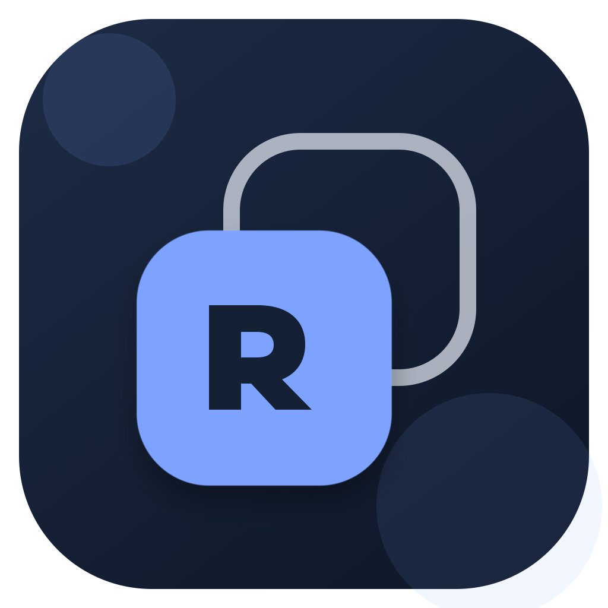
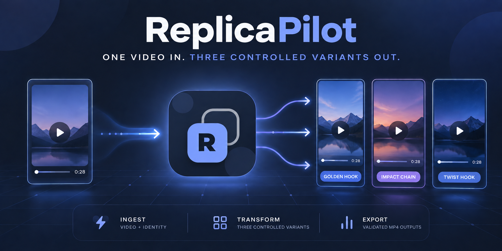
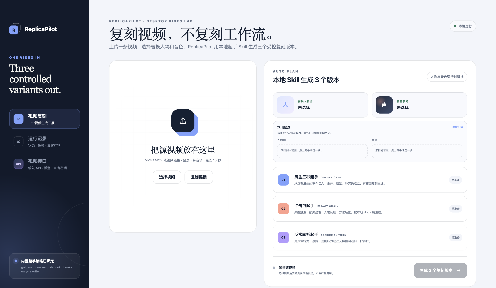
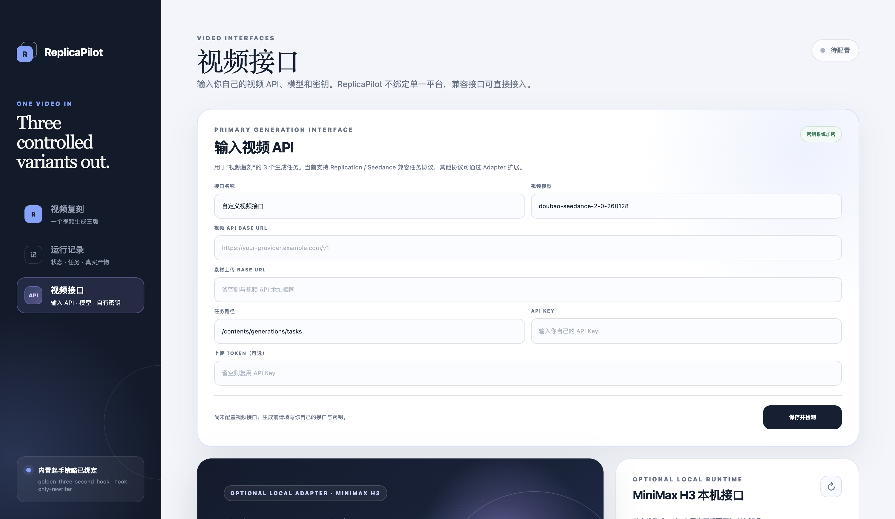

<p align="center">
  
</p>

<h1 align="center">ReplicaPilot</h1>

<p align="center"><strong>AI 视频复刻工作台</strong></p>
<p align="center">一条视频输入，三个受控复刻版本输出。</p>

<p align="center">
  
</p>

<p align="center">
  
  
  
  
</p>

ReplicaPilot 是一款桌面端 AI 视频复刻工具。输入一条竖屏口播视频，再选择替换人物图和音色参考，它会通过使用者自己配置的视频接口准备并生成三个受控版本。

原视频的中心含义、产品事实、场景连续性和中段主要内容保持锁定；人物身份、音色、0–3 秒起手和收尾方向按版本合同受控调整。

## 一眼看懂

| 环节 | 内容 |
| --- | --- |
| 输入 | 1 条最长 15 秒的竖屏视频 + 1 张替换人物图 + 1 段音色参考 |
| 处理 | 本地预检、三版本合同生成、当次付费授权、远端任务恢复 |
| 输出 | 黄金三秒起手、冲击链起手、反常转折起手，共 3 个竖屏版本 |
| 完成标准 | 真实 MP4 已下载，并通过时长、画幅、音轨和媒体可读性校验 |

## 产品界面

### 视频复刻主工作台



### 视频接口与本地运行模组



## 三个受控版本

| 版本 | 0–3 秒策略 | 保持不变的内容 |
| --- | --- | --- |
| 黄金三秒起手 | 第一帧直接进入可见事件，用“主体 + 场景 + 冲突”形成因果变化 | 原产品、场景、中心含义与后续主要内容 |
| 冲击链起手 | 触发失控 → 可见损失 → 声音或物理反馈 → 人物反应 → 方法进入 | 原事实、原证明点与原始回报 |
| 反常转折起手 | 用符合原场景的反常行为、社交碰撞或规则压力制造转折 | 原故事逻辑、替换人物身份与替换音色 |

三个版本都固定输出为竖屏 9:16。ReplicaPilot 不会新增平台 CTA、价格、用户名、水印或未经来源支持的产品主张。

## 能力边界

- 包含：本地视频导入、人物与音色替换、三种起手策略、运行记录、任务恢复、真实产物校验。
- 可选：通过 MeowLoad 粘贴视频链接导入；通过 MiniMax H3 接入本机 ComfyUI、SSH 服务器或 H3 API。
- 不包含：市场研究、账号管理、数据分析、自动发布、内容库和时间线剪辑器。
- 费用边界：准备合约是本地免费操作；提交运行会创建恰好 3 个外部生成任务，必须经过当次明确授权。

## 下载

普通使用者请从 [GitHub Releases](https://github.com/francoeur003/replication/releases) 下载当前版本：

- Windows 10/11 x64：`Replication-2.0.2-windows-x64.zip`
- macOS Apple silicon：`Replication-2.0.2-macOS-arm64.zip`

`ReplicaPilot` 是产品品牌；仓库名、兼容协议和当前 2.0.2 发布包继续保留 `Replication` 技术标识，避免破坏既有配置与下载链接。

### Windows 便携版

完整解压后：

1. 双击 `Configure-Account.cmd`，填写自己的兼容视频接口；也可以稍后在 APP 左侧“视频接口”中配置。
2. 双击 `Replication.exe`。
3. 选择本地视频、替换人物图和音色参考。

Windows 发布包已经内置 Python 3.13、`requests`、FFmpeg、ffprobe 和生成运行脚本，不需要另装 Node.js、Python 或 FFmpeg。当前包未购买代码签名证书，SmartScreen 可能提示“未知发布者”；请只从本仓库 Releases 下载。

### macOS / 源码运行

当前 macOS 包采用临时签名，尚未经过 Apple 公证。源码运行要求：

- Node.js 22.12 或更新版本；
- Python 3；
- FFmpeg 与 ffprobe；
- 一个兼容的视频生成接口及使用者自己的 API Key；
- 可选 MeowLoad，用于粘贴链接导入。

```bash
git clone https://github.com/francoeur003/replication.git
cd replication
npm install
npm run setup:python
brew install ffmpeg
npm run doctor
npm start
```

如果 FFmpeg 已安装，可以跳过 `brew install ffmpeg`。`npm run setup:python` 只创建仓库内的 `.venv`，不会修改系统 Python。

## 视频接口

左侧“视频接口”是生成后端的统一入口。使用者需要填写自己的：

- 接口名称；
- 视频 API Base URL；
- 素材上传 Base URL；
- 任务路径与模型名称；
- API Key；
- 可选的独立上传 Token。

ReplicaPilot 不附带开发者账号或密钥，也不绑定单一供应商。当前 Adapter 支持 Replication / Seedance 兼容任务协议：素材上传接口返回签名上传地址，生成接口返回可轮询的任务 ID。其他协议可以在 `runtime/seedance-face-swap/scripts/` 增加 Adapter，无需改写视频复刻主工作流。

API Key 和上传 Token 通过 Electron `safeStorage` 加密，只在主进程提交任务时注入运行环境，不会返回页面、写入日志或提交到仓库。

### 私人接口配置

推荐直接使用 APP 左侧“视频接口”。需要命令行配置时运行：

```bash
npm run configure
```

默认配置位置：

- Windows：`%APPDATA%\Replication\credentials.json`
- macOS / Linux：`~/.config/replication/credentials.json`

也可以使用环境变量：

```bash
export VIDEO_INTERFACE_NAME="My video provider"
export VIDEO_API_BASE="https://video-api.example.com/v1"
export VIDEO_UPLOAD_BASE="https://upload-api.example.com/v1"
export VIDEO_API_MODEL="your-video-model"
export VIDEO_API_KEY="..."
export VIDEO_UPLOAD_TOKEN="..."
```

如需修改配置文件位置，可设置 `REPLICATION_CREDENTIALS_FILE`。不要把真实凭据提交进仓库。

## MiniMax H3 可选模组

“视频接口”工作区包含可选的 MiniMax H3 模组：

- 本机 ComfyUI：检测 6006/8188 服务，以及 H3 生成模型、文本编码器、视频 VAE 和音频 VAE。
- SSH 服务器：保存主机、端口、用户名、远程工作目录和本机私钥路径，并使用 `BatchMode` 做无密码连通测试。
- H3 API：输入 API Base URL、模型名称和 API Key；密钥通过 `safeStorage` 加密。
- 官方模型下载：列出 Comfy-Org/MiniMax-H3 的 R2V 模型、文本编码器和视音频 VAE，并显示目标目录与安装状态。

可以通过 `REPLICATION_MINIMAX_H3_URL` 和 `REPLICATION_MINIMAX_H3_COMFY_ROOT` 覆盖默认本机连接与工作区路径，也可以通过 `MINIMAX_H3_API_KEY` 从环境变量提供 API 凭据。

## 测试

```bash
npm run doctor
npm test
npm start
```

本地集成测试只准备 3 份 dry-run 合约，不提交付费任务：

```bash
npm run test:integration -- \
  "/absolute/path/to/vertical-video.mp4" \
  "/absolute/path/to/person.png" \
  "/absolute/path/to/voice.mp3"
```

## 构建

macOS Apple silicon：

```bash
npm run build:mac
```

Windows x64：

```powershell
npm run prepare:win-runtime
npm run build:win
```

GitHub Actions 会在 Windows runner 上完成依赖下载、SHA-256 校验、单元测试、运行依赖自检、打包、应用启动截图和 ZIP 产出。

## 第三方运行组件

Windows 便携包使用：

- [Python Windows embeddable package](https://docs.python.org/3.13/using/windows.html)，Python Software Foundation License；
- [FFmpeg](https://ffmpeg.org/download.html) 推荐的 Windows essentials build，随包保留许可证；
- `requests` 及依赖，许可证保留在各自的 `.dist-info` 目录。
